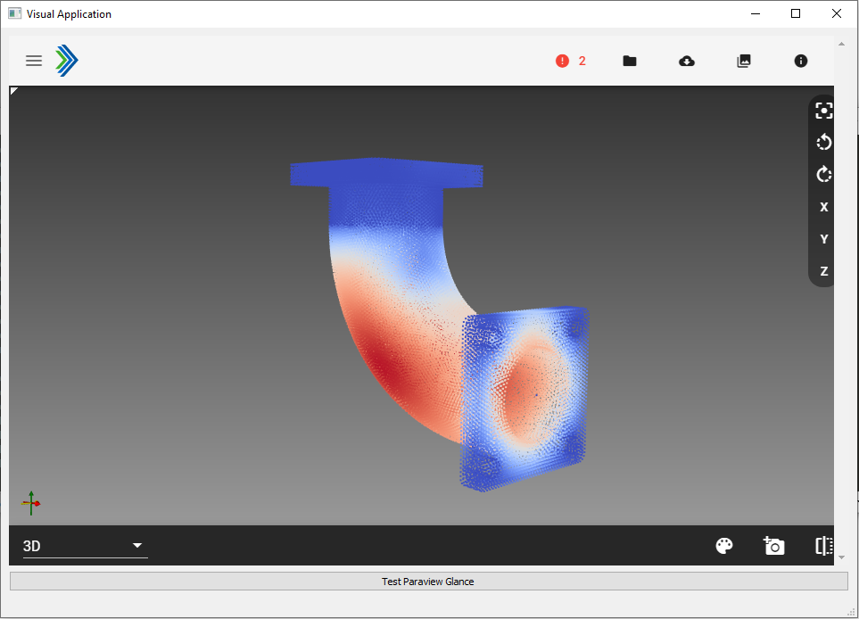

## Simple PyQt app integrated with Paraview Glance

The application is an example on how to integrate pyqt and paraview. It is simple in terms of design, but it provides all the necessary components to develop a more mature app. This toy example is explained in [LINK to medium].

To use it, please create a virtual environment called `qtenv`, with python 3.9, and install the packages provided in `requirements.txt`. In addition, you must have Paraview in your local machine, with `pvpython` (the python of Paraview) in your path. To check you have a valid `pvpython` installed, just run the command `pvpython` in your console, and after python is launched, write `from paraview import simple`.

Activate the virtualenvironment and run: `python main_app.py`. Then, hit the visualization button to obtain the following result:

In folder `issues`, you can find a file with fixes to typical issues.
